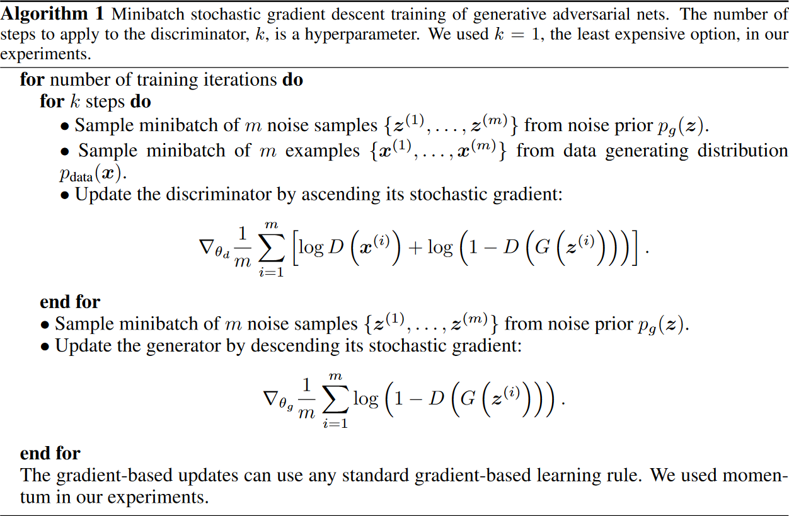

### Introduction

A Generative Adversarial Network, in short GAN, is a class of machine learning models introduced by Ian Goodfellow et al in their famous [paper with the same name][ian-goodfellow-gan].

A GAN model is a generative model, meaning that it is trained to generate data that resembles the training data. For example, a GAN model trained on many pictures of dogs, should be able to generate novel pictures of dogs.
Generative model usually (but it is not always the case!) start with random noise and then gradually denoise for a pre-defined number of steps.

### Basic idea

Before deep diving into how it works, let me make a simple example to understand the basic idea:

Imagine there is an artist who is copying Leonardo Da Vinci's works and sells them as originals, we will call this person the Generator (the *bad* guy). His goal is to make as much money as possible by making replicas of real paintings and selling them as originals.\
Imagine there is another actor in this story, let's call it [Inspector Colombo](https://en.wikipedia.org/wiki/Columbo) (the *good* guy), who is investigating on the case and whose job is to tell if a painting being sold is real or a fake one. We will refer to this latter actor as the Discriminator.

The two actors in this game always play against each other: the goal of the Generator is to generate fake paintings, while fooling the Discriminator in believing that his paintings are authentic; the goal of the Discriminator is to spot as many fake paintings as possible.

### In practice

In practice, we need to train a Generator model that, given random noise, becomes better and better at producing outputs that resemble the training data.
Simultaneously, we train a Generator model that plays against the Generator.

How the two models compete against each other is better understood when loss functions are introduced.

### Definitions

All the symbols are taken from the original papers.

$G$ = Generator\
$D$ = Discriminator\
$θ_{g}$ = parameters of the Generator\
$θ_{d}$ = parameters of the Discriminator

Additionally, we need to define the following distributions:

$P_{z}(z)$ = Random noise given as input to the Generator\
$P_{data}(x)$ = Distribution of the original training data (real samples)\
$P_{g}(x)$ = Distribution of the data generated by the Generator (fake samples)

### The minimax game

In the original paper, the following formula describes the minimax game played by the two actors:

$$\color{#1A120B}{\underset{G}{min}\;\underset{V}{max}\;V(D,G)} \color{#1A120B}{=} \color{#2C74B3}{\mathbb{E}_{x \sim p_{data}(x)}[logD(x)]} \color{#1A120B}{+} \color{#0A2647}{\mathbb{E}_{z \sim p_{z}(z)}[log(1-D(G(z)))]}$$

The left side of the summation, the one written in light blue color, is high if the `Dicriminator` is labeling real data as real, because $D(x)$ is the probability of the `Discriminator` labeling $x$ as real data. In this term, $x$ is a sample from the training data.

The right side of the summation, written in dark blue , is high if the `Discriminator` is labeling fake data as fake, because $D(G(z))$ is the probability of the `Discriminator` labeling a fake sample as real. In this term, $G(z)$ is a sample generated from the Generator starting from random noise (a fake painting). 

Now that we understand the two terms of the summation, which of the two actors would want to maximize this loss? Which one would want to minimize it?

The answer is pretty simple, and written on the left side of the equation above: the `Discriminator` want to maximize this loss function, because it means it is doing a good job. The `Generator` want to minimize this loss function, because it means fooling the Discriminator.

### Training

The training loop is presented in the paper, and I will copy and paste it as is:

As we can see from the code, the algorithm fetches a minibatch (of size $m$) of noise, and another minibatch of the same size from the training data.

The algorithm first updates the `Discriminator`, whose loss function is **maximized**.

The algorithm then updates the `Generator`, whose loss function is **minimized**.

### Conclusion

GANs have been around since a while and have paved the way for more complex models, for example `CycleGAN`, `StyleGAN`, etc. on which I will write in the future.

[ian-goodfellow-gan]: https://arxiv.org/abs/1406.2661
