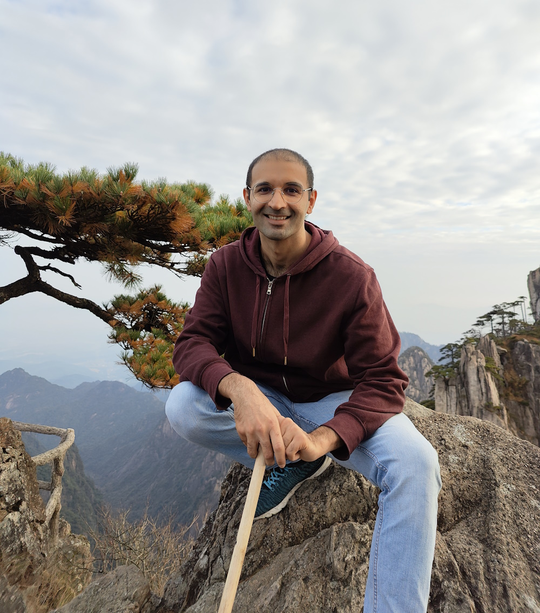

---
# Feel free to add content and custom Front Matter to this file.
# To modify the layout, see https://jekyllrb.com/docs/themes/#overriding-theme-defaults

layout: page
---

{:refdef: style="text-align: center;"}
{: .align-center width="400px"}
{: refdef}

Hi! I'm Umar Jamil 👨🏽, a machine learning engineer from Milan, Italy. I speak Italian, English, Urdu and Mandarin. My wife's family calls me 小乌 (xiǎowū).

You can connect with me on 💼 [LinkedIn](https://www.linkedin.com/in/ujamil/).

I run a 🎬 [YouTube channel](https://www.youtube.com/@umarjamilai) to teach machine learning and AI concepts in a simple way.

Here are some of my projects:

🪢 [ML Interpretability: feature visualization, adversarial example, interp. for language models](https://youtu.be/lg1-M8hEX50)

🕸️ [Kolmogorov-Arnold Networks: MLP vs KAN, Math, B-Splines, Universal Approximation Theorem](https://youtu.be/-PFIkkwWdnM)

🎯 [Direct Preference Optimization (DPO) explained: Bradley-Terry model, log probabilities, math derivations](https://youtu.be/hvGa5Mba4c8)

📐 [Reinforcement Learning from Human Feedback explained with math derivations and the PyTorch code](https://www.youtube.com/watch?v=qGyFrqc34yc)

🐍 [Mamba and S4 Explained: Architecture, Parallel Scan, Kernel Fusion, Recurrent, Convolution, Math](https://www.youtube.com/watch?v=8Q_tqwpTpVU)

🌈 [Mistral 7B and Mixtral 8x7B Explained: Sliding Window Attention, Sparse Mixture of Experts, Rolling Buffer (KV) Cache, Model Sharding](https://www.youtube.com/watch?v=UiX8K-xBUpE)

🔬 [Distributed Training with PyTorch: complete tutorial with cloud infrastructure and code](https://www.youtube.com/watch?v=toUSzwR0EV8)

⚛️ [Quantization explained with PyTorch - Post-Training Quantization, Quantization-Aware Training](https://www.youtube.com/watch?v=0VdNflU08yA)

🗃️ [Retrieval Augmented Generation (RAG) Explained: Embedding, Sentence BERT, Vector Database (HNSW)](https://www.youtube.com/watch?v=rhZgXNdhWDY)

👨 [BERT explained: Training, Inference,  BERT vs GPT/LLamA, Fine tuning, [CLS] token](https://www.youtube.com/watch?v=90mGPxR2GgY)

🌄 [Coding Stable Diffusion From Scratch](https://www.youtube.com/watch?v=ZBKpAp_6TGI)

🦙 [Coding LLaMA 2 From Scratch](https://www.youtube.com/watch?v=oM4VmoabDAI)

🦙 [LLaMA explained: KV-Cache, Rotary Positional Embedding, RMS Norm, Grouped Query Attention, SwiGLU](https://www.youtube.com/watch?v=Mn_9W1nCFLo)

🌍 [Segment Anything - Model explanation with code](https://www.youtube.com/watch?v=eYhvJR4zFUM)

🧮 [LoRA: Low-Rank Adaptation of Large Language Models - Explained visually + PyTorch code from scratch](https://www.youtube.com/watch?v=PXWYUTMt-AU)

⛓ [LongNet: Scaling Transformers to 1,000,000,000 tokens: Python Code + Explanation](https://www.youtube.com/watch?v=nC2nU9j9DVQ)

🖼 [How diffusion models work - explanation and code!](https://www.youtube.com/watch?v=I1sPXkm2NH4)

⚙️ [Variational Autoencoder - Model, ELBO, loss function and maths explained easily!](https://www.youtube.com/watch?v=iwEzwTTalbg)

🎛 [Coding a Transformer from scratch on PyTorch, with full explanation, training and inference.](https://www.youtube.com/watch?v=ISNdQcPhsts)

🪬 [Attention is all you need (Transformer) - Model explanation (including math), Inference and Training](https://www.youtube.com/watch?v=bCz4OMemCcA)
